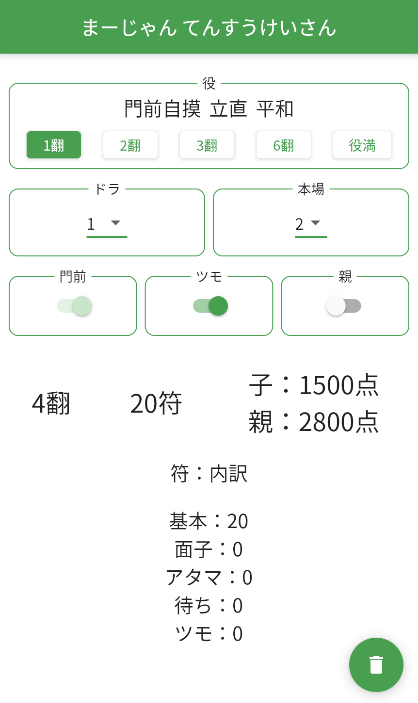

# 麻雀 点数計算アプリ

麻雀の点数計算 + Flutter勉強用のアプリです。  
Flutter Webを利用してブラウザから誰でも利用できるようにしています。  
※現状はスマホサイズしか対応していません。（麻雀中はスマホでの利用の方が高い？と思うので優先）

[まーじゃん てんすうけいさん](https://mahjong-score-c8ef6.web.app/)

## 前提
本アプリは下記のような利用を想定しています。
- 点数計算を簡単に行いたい
- 役は覚えているけど、点数計算（特に符計算）が出来ない

## 機能
本アプリでは下記を機能を提供します。
- 役の選択
- 条件の選択
  - ドラ数
  - 本場数
  - 門前 or not
  - ツモ or ロン
  - 親 or 子
  - 面子の形（1～4）
  - アタマの形
  - 待ちの形
- 役 + 条件の組み合わせに応じた点数詳細表示
  -  翻数
  -  符の最終数
  -  点数（本場も含めた点数）
    -  親 or 子、ツモ or ロンの条件によって表示内容は変わります
  - 符の内訳
    - 基本
    - 面子
    - アタマ
    - 待ち
    - ツモ

- PWA
  - Firebaseのhostingを利用しているためPWAの機能は自動で付与されている？
    - 設定した記憶がないため、要調査
    - 本件は[issue](https://github.com/oishii-pg-gohan/mahjong_score/issues/17)で対応予定
